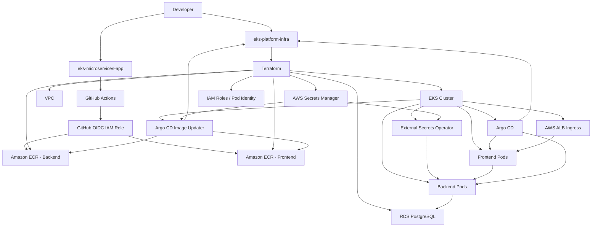

# eks-platform-infra

AWS infrastructure and GitOps configuration for an EKS-based microservices platform.

This repository provisions the cloud infrastructure and defines the Kubernetes deployment state for the application stack running on Amazon EKS.

---

## Overview

`eks-platform-infra` is the infrastructure repository for an end-to-end Kubernetes platform on AWS.

It covers:

- infrastructure provisioning with Terraform
- Kubernetes deployment packaging with Helm
- GitOps delivery with Argo CD
- automated image updates with Argo CD Image Updater
- secret management with AWS Secrets Manager and External Secrets Operator
- secure identity-based access with GitHub OIDC and EKS Pod Identity

The application source code is maintained separately in:

- `eks-microservices-app`

This split keeps application development and infrastructure management clearly separated.

---

## Architecture

At a high level, the platform works as follows:

1. Terraform provisions the AWS foundation:
   - VPC
   - subnets
   - EKS cluster
   - ECR repositories
   - RDS PostgreSQL
   - Secrets Manager secrets
   - IAM roles and pod identity associations

2. The application repository builds container images and pushes them to Amazon ECR.

3. Argo CD reads this repository and deploys the defined state into the cluster.

4. Argo CD Image Updater watches ECR for newer images and updates the Helm values files in this repository.

5. Argo CD detects the Git change and reconciles the cluster automatically.

This makes Git the source of truth for deployment state.

---

## Architecture Diagram



---

## Why These Tools Were Used

### Terraform
Terraform is used to provision and manage AWS resources in a reproducible, version-controlled way.

It was chosen for:
- infrastructure as code
- modular design
- repeatable environments
- easier change tracking

### Amazon EKS
EKS provides the managed Kubernetes control plane.

It was chosen for:
- managed Kubernetes on AWS
- integration with IAM, ALB, and VPC networking

### Helm
Helm is used to package and deploy the backend and frontend workloads.

It was chosen for:
- reusable Kubernetes manifests
- environment-specific configuration through values files
- cleaner deployment structure

### Argo CD
Argo CD is the GitOps controller for the platform.

It was chosen for:
- Git-based deployment state
- automatic reconciliation
- reduced reliance on manual deployment commands

### Argo CD Image Updater
Image Updater watches the container registries and updates image references in Git.

It was chosen for:
- automated image promotion
- keeping image state in Git
- removing manual tag updates from the deployment flow

### Amazon ECR
ECR stores the backend and frontend container images.

It was chosen for:
- native AWS registry integration
- IAM-based access control
- direct fit for EKS workloads

### Amazon RDS PostgreSQL
RDS provides the relational database for the backend.

It was chosen for:
- managed database operations
- private subnet placement
- a cleaner design than running the database inside the cluster

### AWS Secrets Manager
Secrets Manager stores sensitive values such as:
- database password
- Git write-back credential for Image Updater

It was chosen for:
- centralized secret storage
- better security than local or hardcoded secret handling
- integration with External Secrets Operator

### External Secrets Operator
External Secrets Operator syncs values from Secrets Manager into Kubernetes.

It was chosen for:
- secret delivery into the cluster without storing secrets in Git
- cleaner integration between AWS secrets and Kubernetes workloads

### GitHub Actions and GitHub OIDC
GitHub Actions builds and pushes application images. GitHub OIDC is used for AWS authentication.

They were chosen for:
- native CI/CD integration with GitHub
- secure authentication without long-lived AWS access keys

### EKS Pod Identity
Pod Identity gives Kubernetes workloads access to AWS services without static credentials.

It was chosen for:
- IAM-based pod access
- cleaner credential management
- better security for in-cluster workloads

---

## Repository Structure

```text
eks-platform-infra/
├── environments/
│   └── dev/
├── modules/
│   ├── ecr/
│   ├── eks/
│   ├── github_actions_oidc/
│   ├── rds/
│   ├── secretsmanager/
│   └── vpc/
└── kubernetes/
    ├── argocd/
    │   ├── apps/
    │   └── image-updater/
    └── helm/
        ├── backend/
        └── frontend/
```

---

## Deployment Flow

The deployment flow is:

1. A change is merged into `eks-microservices-app`
2. GitHub Actions builds backend and frontend images
3. New images are pushed to ECR
4. Argo CD Image Updater detects the updated image
5. Image Updater updates the relevant `values-dev.yaml` file in this repository
6. Argo CD detects the Git change
7. Argo CD reconciles the updated state into the cluster

This removes the need for manual image tag updates and manual Helm deploy commands.

---

## Security Approach

This project avoids long-lived cloud credentials and keeps secrets out of Git.

Key choices:
- GitHub OIDC instead of AWS access keys
- AWS Secrets Manager for sensitive values
- External Secrets Operator for syncing secrets into Kubernetes
- EKS Pod Identity for in-cluster AWS access
- scoped IAM policies for GitHub Actions and Image Updater

---

## What This Repository Owns

This repository is responsible for:

- AWS infrastructure provisioning
- Kubernetes deployment configuration
- Argo CD Applications
- Argo CD Image Updater configuration
- GitOps deployment state

It does not contain the backend and frontend application source code.

---

## Example Validation

A visible frontend UI change was used to validate the complete flow:

- application change merged into the app repository
- GitHub Actions built and pushed a new image to ECR
- Argo CD Image Updater updated the Helm values in this repository
- Argo CD reconciled the cluster
- the updated frontend became visible through the ALB

This confirmed the CI/CD and GitOps chain was working end to end.

---

## Future Improvements

Possible future improvements include:

- CI validation for the infrastructure repository
- replacing the GitHub token with a GitHub App for Image Updater
- adding a staging environment
- expanding observability and alerting
- tightening database access further

---

## Related Repository

Application source code:

- `eks-microservices-app`

---

## Final Notes

This repository represents the infrastructure and GitOps side of the platform.

It brings together infrastructure provisioning, secret management, secure authentication, image automation, and Git-based Kubernetes delivery in a single workflow.
